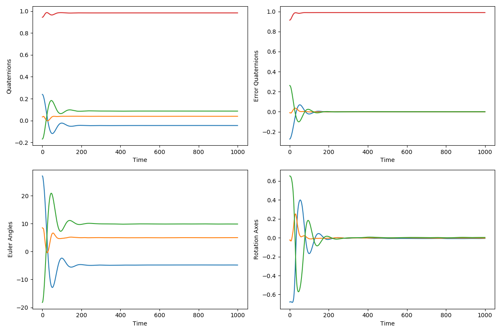
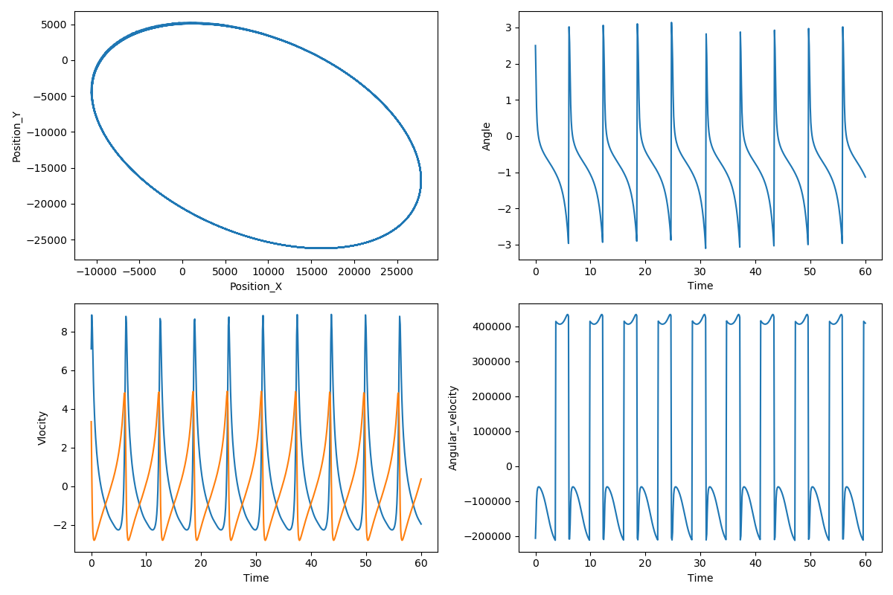

# 人工衛星の制御アルゴリズムを用いた技術ポートフォリオ
本ページは姿勢制御アルゴリズムに関するポートフォリオになります。
本ポートフォリオで使用している技術は以下になります。

* 姿勢制御アルゴリズム
  * 簡易的なオブザーバ、コントローラ、プラントモデルの作成
  * 座標変換(クォータニオン, 回転行列, オイラー角間)の使用

* 軌道決定アルゴリズム
  * 軌道6要素による衛星軌道算出、最適化

また、今後は姿勢制御、軌道決定アルゴリズムを合わせた制御処理の実装を検討しています。

## Application abstract
* 人工衛星制御のシミュレーション

### 姿勢制御アプリケーション
* アプリケーション概要

人工衛星の姿勢制御のシミュレーションを行います。センサにてロール・ピッチ・ヨーのオイラー角を検出した後、クォータニオンに変換してフィードバック制御を行います。また衛星には一定の外部応力や慣性モーメントが発生するものとします。

* センサ概要

このアプリケーションでは、以下センサを使用します。尚、姿勢センサは各姿勢情報を取得するセンサ情報を統合した、精度の高い情報と仮定します。
  * ジャイロセンサ
  * 姿勢センサ

ジャイロセンサにて角速度を検出します。
姿勢センサはロール・ピッチ・ヨーのオイラー角を検出して、センサ内でクォータニオンへ変換します。
各センサはノイズやバイアスによって、一定の検出誤差が発生するものとして、2回移動平均を取った値を制御器へ入力情報として渡しています。

* 制御概要

  * 簡易カルマンフィルタによって、センサ情報とモデル内で推定している角速度及び姿勢情報を推定しています。
  * FF制御として、外乱を事前に算出する事で制御対象の応答を改善しています。
  * クォータニオンを用いた剛体の回転運動の方程式を演算する事で、dw/dt, dq/dtを算出します。
  * PID制御によりフィードバック制御を行います。尚、制御アルゴリズムでは各加速度、速度に各レートを定義することでアクチュエータへの過負荷を抑制しています。


* アクチュエータ

ロール・ピッチ・ヨーの各オイラー角に対して、一定のトルク出力を発生させられるアクチュエータがあると仮定します。

* 出力

出力はoutディレクトリにまとめています。
出力は衛星の姿勢制御の遷移をプロットしたグラフとして得られます。
グラフは時間と共に衛星のクォータニオン、クォータニオン誤差、オイラー角、回転軸を表します。衛星の姿勢が一定の値で収束している事が分かります。




## Software Architecture

エントリーポイントはmain.py関数に記載。ライブラリはlibに保存しています。kalmanfilter, pid, 座標変換等複数参照されるものは、utility処理として、utilフォルダに格納しています。

`````
satellite/
│
├── lib/
│ ├── ff.py             ﾌｨｰﾄﾞﾌｫﾜｰﾄﾞ制御処理
│ ├── omega.py          角速度推定処理
│ ├── state.py          姿勢推定処理
│ └── util/
│     ├── kfilter.py    ｶﾙﾏﾝﾌｨﾙﾀ処理
│     ├── pid.py        PID制御処理
│     ├── plot.py       ﾌﾟﾛｯﾃｨﾝｸﾞ処理
│     └── transform.py  座標変換処理
│
└── main.py              main関数
`````

制御モデルに関しては以下参考下さい。


### 軌道決定アプリケーション
* アプリケーション概要
このアプリケーションは、衛星の軌道要素を最適化し、その位置・速度・角速度を計算し、可視化します。最適化は、観測データと計算された軌道要素を比較し、二乗和残差を最小化することで行われます。

* センサ概要

このアプリケーションでは、衛星の位置データを観測データとして使用します。観測データは、衛星の地球中心慣性座標系における3次元位置ベクトルで表されます。

* 制御概要

アプリケーションは、軌道要素を最適化するために最小二乗法を使用します。観測データと計算された軌道要素の差を最小化することで、最適な軌道要素が得られます。

* アクチュエータ

このアプリケーションでは、アクチュエータは直接的に扱われません。代わりに、軌道要素の最適化に焦点が当てられています。

* 出力

出力は、衛星の軌道遷移をプロットしたグラフとして得られます。
グラフは、時間とともに衛星の2次元位置、角度、速度、および角速度を表します。さらに、最適化された軌道要素が表示されます。衛星の軌道が楕円軌道となっており、他値も周期的に遷移している事が分かります。



## Software Architecture

軌道算出ソフトは[orbit.py](orbit/orbit.py)を参照ください。
アーキテクチャは未検討となります。
