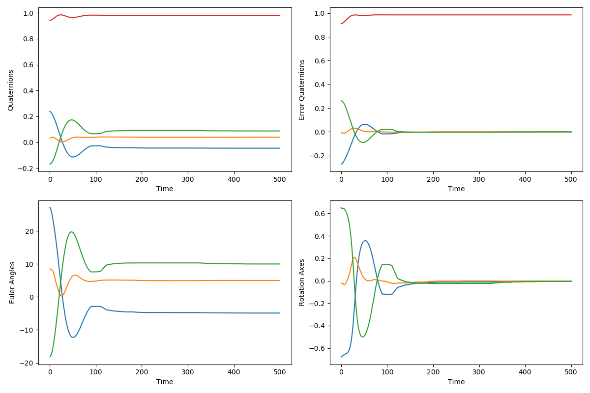

# 姿勢制御アルゴリズムを用いた技術ポートフォリオ
本ページは姿勢制御アルゴリズムに関するポートフォリオになります。
本ポートフォリオで使用している技術は以下になります。

* 座標変換(クォータニオン, 回転行列, オイラー角間)の使用
* フィードバック制御

## Application abstract
* 航空機フィードバック制御のシミュレーション

### アプリケーション詳細
* ロボット概要

航空機の姿勢制御のシミュレーションを行います。センサにてロール・ピッチ・ヨーのオイラー角を検出した後、クォータニオンに変換してフィードバック制御を行います。また、航空機には一定の外部応力や慣性モーメントが発生するものとします。

* センサ概要

センサにてロール・ピッチ・ヨーのオイラー角を検出します。ノイズやバイアスによって、一定の検出誤差が発生するものとします。

* 制御概要

PIDにて目標-推定の姿勢誤差をフィードバック制御する。

* アクチュエータ

ロール・ピッチ・ヨーの各オイラー角に対して、一定のトルク出力を発生させられるアクチュエータがあると仮定します。アクチュエータ自体もバイアス、ノイズが発生するものとします。

* 出力

outディレクトリに出力結果をまとめています。
[combined_graph.png](out/combined_graph.png)には、クォータニオン、クォータニオン誤差、オイラー角、回転軸を.png形式で出力しています。

## Software Architecture

未検討